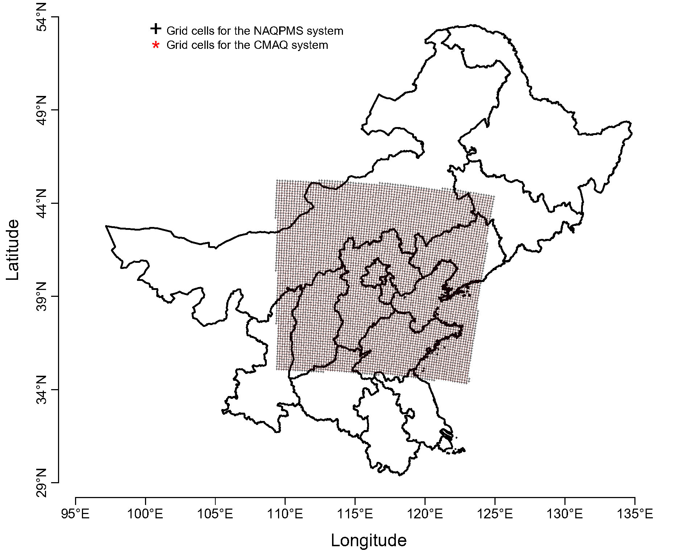
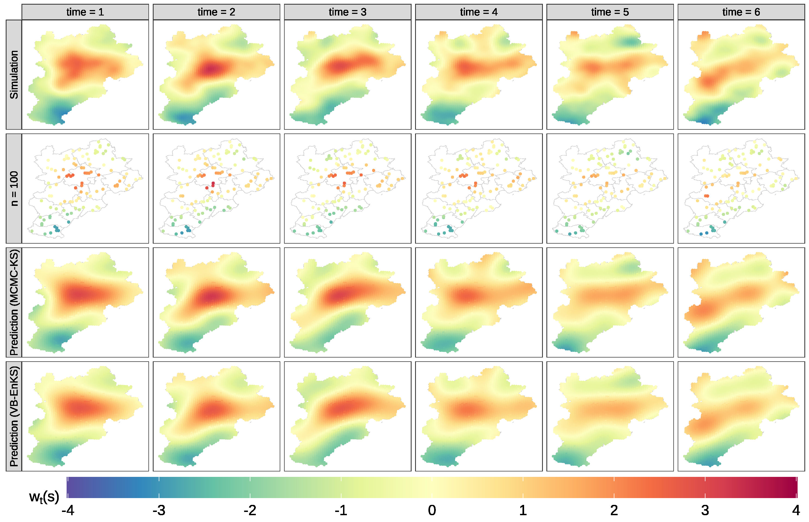

# Efficient and Effective Calibration of Numerical Model Outputs Using Hierarchical Dynamic Models

This Github page provides code and data for reproducing the results in the manuscript: Y. Chen, X. Chang, B. Zhang, and H. Huang. [Efficient and effective calibration of numerical model outputs using hierarchical dynamic models](https://projecteuclid.org/journals/annals-of-applied-statistics/volume-18/issue-2/Efficient-and-effective-calibration-of-numerical-model-outputs-using-hierarchical/10.1214/23-AOAS1823.full)[J]. The Annals of Applied Statistics, 2024, 18(2): 1064-1089.

## Datasets
The effectiveness and efficiency of the proposed ``HDCM`` are demonstrated using two datasets.

- Moderately large datasets. These consist of $PM_{2.5}$ concentrations obtained from monitoring stations and the outputs of the Community Multiscale Air Quality (CMAQ) system for China's Beijing-Tianjin-Hebei (BTH) region. The dataset sizes are as follows: $68 \times 92 = 6{,}256$ spatio-temporal observations for monitoring stations and $5{,}587 \times 92 = 514{,}004$ raw spatio-temporal outputs for CMAQ, where the number of monitroing stations is 68, the number of CMAQ grid cells is $5{,}587$, and the time length is 92 days.

- Large datasets. These include the reanalysis of $PM_{2.5}$ outputs of the Nested Air Quality Prediction Modeling System (NAQPMS) and the raw $PM_{2.5}$ outputs of the CMAQ system. The dataset sizes are $6,382 \times 30 = 191{,}460$ spatio-temporal gridded outputs for NAQPMS and $16,093 \times 30 = 482,790$ raw gridded outputs for CMAQ, respectively.

<!-- # An illustration for the first dataset in the BTH region
<figure id="Figure1">
  <p align="center">
  
    </p>
  <figcaption
  <strong>Figure 0:</strong> (a) Map of China. (b) Zoomed-in map of the BTH region along with locations of $68$ monitoring stations (red dots) and centroids of $5{,}587$ 9-km CMAQ grids (gray dots).} (c)-(e) Scatter plots of CMAQ $PM_{2.5}$ forecasts versus actual observations at Zhangjiakou, Beijing, and Hengshui in different seasons, where ``Corr'' represents the Pearson correlation coefficient between CMAQ $PM_{2.5}$ outputs and observed $PM_{2.5}$ concentrations. Three reference lines with the slope k = 0.5, 1, and  2 are colored in gray.
  </figcaption>
</figure> -->

  
## Reanalysis datasets of $PM_{2.5}$ concentrations 
<figure id="Figure1">
    <p align="center">
  
  </p>
  <figcaption>
  <strong>Figure 1:</strong> Maps of grid cells of the CMAQ and the NAQPMS. The symbols ``+'' represent the centroids of 16093 9km CMAQ grids. The symbols ``*'' denote the centroids of 6382 15km NAQPMS grids.
  </figcaption>
</figure>

###

In this paper, we introduce a Bayesian hierarchical dynamic model referred to as 'HDCM' and present an algorithm that combines Variational Bayes (VB) and Ensemble Kalman Smoother (EnKS), as described in Evensen and Van Leeuwen (2000), to expedite the parameter estimation and calibration process. To enhance the scalability of HDCM, we incorporate the Laplace approximation into VB and employ a space-partitioning-based procedure in EnKS. Both VB and the space-partitioning-based EnKS, denoted as 'spEnKS,' have been implemented through our R package - [HDCM](https://github.com/ChenYW68/HDCM/tree/main/HDCMc/LoadPackages).

## Software packages
Our code consists of two parts: 
1. The VB-spEnKS algorithm was written into the [HDCM](https://github.com/ChenYW68/HDCM/tree/main/HDCMc/LoadPackages) package in the R statistical environment;
2. A project entitled ``[HDCMc.Rproj](https://github.com/ChenYW68/HDCM/tree/main/HDCMc)'' in the [RStudio](https://www.rstudio.com/products/rstudio/download/) environment was built to reproduce all the results (e.g., figures and tables) in this work. 

## Installing and loading dependent packages
- Depends:	R (≥ 4.2.1)
-	Open the project file, ``[HDCMc.Rproj](https://github.com/ChenYW68/HDCM/tree/main/HDCMc/LoadPackages)'', based on the [RStudio](https://www.rstudio.com/products/rstudio/download/) tool.

-	Install all the required packages using the following command:
```
source("./LoadPackages/RDependPackages.R")
```
Moreover, the [HDCM](https://github.com/ChenYW68/HDCM/tree/main/HDCMc/LoadPackages) package can be installed by running:
```
 install.packages("./LoadPackages/HDCM_1.0.zip", repos = NULL, type = "win.binary")
```

## An example of the proposed ``HDCM`` for large spatio-temporal data
```
# install.packages("./LoadPackages//HDCM_1.0.zip", repos = NULL, type = "win.binary")
rm(list=ls())
source("./LoadPackages/RDependPackages.R")
load("./data/NAQPMS_CMAQ_Dataset_2015W.RData")
load("./data/Large_BTH_map.RData")
Site <- Site[distToNearestCAMQpoint <= 15]
set.seed(12345)
PM25_2015w <- NAQPMS_CMAQ_Dataset_2015W[distToNearestCAMQpoint <= 15]
#--------------------------------------------------------------------------------------
#--- Training and test datasets
n.train <- 5000
train.id <- sample(Site$ID, n.train, replace = F)
cat("The number of training set:", length(train.id))

Site$Flag <- ifelse(Site$ID %in% train.id, "train", "test")
PM25_2015w$Flag <- ifelse(PM25_2015w$ID %in% train.id, "train", "test")
#--------------------------------------------------------------------------------------
rm(NAQPMS_CMAQ_Dataset_2015W)

#--------------------------------------------------------------------------------------
# 1. Create a mesh through a triangulation scheme based on the ``INLA`` 
#    package (Lindgren and Rue, 2015), a spatial partitioning procedure is 
#    embedded in our triangulation scheme.
#--------------------------------------------------------------------------------------
Ch <- 0.05; R <- 3; Cs <- 8e-2; Ct <- 1; Ne <- 100
H.basic.data <- CreateGrid(PM25_2015w,
                           Site,
                           Map = fortify(larg_bth_map),
                           ## 2042
                           # max.edge = c(.35, .7),
                           # offset = c(1e-1, 0.6),
                           # cutoff = .23, # 0.5
                           ##3158
                           # max.edge = c(.23, .4), 
                           # offset = c(1e-1, 0.9), 
                           # cutoff = 0.3,
                           ## 10103
                           max.edge = c(.21, .3),
                           offset = c(1e-1, 0.9), 
                           cutoff = 0.11,
                           distance.scale = 1e3,
                           R.sqrt = R,
                           col = "blue",
                           size = 1,
                           site.id = "ID",
                           ch = Ch,
                           method = "Wendland",
                           response.label = "PM25",
                           distance.method = 1,
                           Grid = TRUE,
                           scale = 5)
H.basic.data$plot.grid
```
<figure id="Figure2">
    <p align="center">
  
  </p>
  <figcaption>
  <strong>Figure 2:</strong> Triangulated mesh for the reanalysis dataset with 9 subregions, and centroids of the subregions are marked with red dots.
  </figcaption>
</figure>


```
#######################################################################################
#--------------------------------------------------------------------------------------
#                               2. Data preparation for modeling
#--------------------------------------------------------------------------------------
#--Data are transformed via the square root transformation to stabilize the variance
PM25_2015w[, c("sim_CMAQ_PM25")] <- sqrt(PM25_2015w[, c("sim_CMAQ_PM25")])

#-- Sellect the time rang of data
PM25_2015w <- PM25_2015w %>% dplyr::filter(between(as.Date(DATE_TIME), 
                                                   as.Date(paste0(2015, "-", "11-01")),
                                                   as.Date(paste0(2015, "-", "11-30"))))
  
#-- Combine other variables with time variable
DATE_TIME <- unique(PM25_2015w$DATE_TIME) %>% sort()
Nt <- length(DATE_TIME)
date.time <- data.frame(time.index = 1:Nt,
                        time.scale = seq(0, 1, , Nt),
                        DATE_TIME = DATE_TIME)
PM25_2015w <- PM25_2015w  %>% left_join(date.time, by = c("DATE_TIME"))

#--Standardization
HDCM.Data <- Construct_HDCM_Data(data = PM25_2015w,
                                 include = list(YEAR = c(2015, 2016),
                                                month_day = c("11-01", "1-31")),
                                 Y = "PM25",
                                 X = c("sim_CMAQ_PM25", "TEMP", "WIND_X", "WIND_Y"),
                                 standard = T, center = T, start.index = 1)
#######################################################################################                              
#--------------------------------------------------------------------------------------
#                               3. Settings for the HDCM
#--------------------------------------------------------------------------------------
  theta.2 <- c(1e-1, 1E-3, 1E0)
  res.num <- H.basic.data$Grid.infor$summary$res
  p1 <- dim(HDCM.Data$X_ts)[1]
  
  #--3.1 Prior
  prior <- list(
                beta = list(E_beta = rep(0, p1), sigma.sq = 1e5*diag(1, p1, p1))
              , obs.sigma.sq = list(a = 2, b = 1)
              , theta.1 = list(mu = rep(1e-3, res.num), sigma.sq =  rep(1e5, res.num))
              , theta.2 = list(a = rep(theta.2[2], res.num), b =  rep(theta.2[3], res.num))
              , zeta = list(a = rep(1e-3, res.num), b =  rep(1e0, res.num))
              , zeta0 = list(a = rep(1e-3, res.num), b =  rep(1e0, res.num))
              , proc.tau.sq = list(a = rep(2, res.num), b = rep(1, res.num))
              , proc0.tau.sq = list(a = rep(2, res.num), b = rep(1, res.num))
            )
  #--3.2 Initialize  parameters
  para <- list( beta = list(E_beta = c(8, 1, rep(0, p1 - 2))),
                  obs.sigma.sq = list(E_sigma.sq = 1, a = 2, b = 1)
                , theta.1 = list(E_theta.1 = rep(1e-3, res.num))
                , theta.2 = list(E_theta.2 = rep(theta.2[1], res.num))
                , zeta = list(E_zeta = rep(1e-1, res.num))
                , zeta0 = list(E_zeta0 = rep(1e-1, res.num))
                , proc.tau.sq = list(E_tau.sq = rep(5e0, res.num))
                , proc0.tau.sq = list(E_tau.sq = rep(1E0, res.num))
              )
#--------------------------------------------------------------------------------------
#                               4.  Fitting and predictions
#--------------------------------------------------------------------------------------
#-- A name for a list of all objects that will be saved
tab.1 <- strsplit(as.character(Ch), ".", fixed = TRUE)[[1]][2]
tab.2 <- strsplit(as.character(Cs), ".", fixed = TRUE)[[1]][2]
m <- sum(H.basic.data$Grid.infor$summary$Knots.count)
tab <- paste0("L", R^2, "_", tab.1, "_", tab.2, "_", n.train, "_", m)

#--Oracle
# Oracle.infor <- list(DSN = RODBC::odbcConnect("DSN_01",
                                   #  uid = "myname",
                                   #  pwd = "mypwd",
                                   #  believeNRows = FALSE,
                                   #  case = "toupper")),
Oracle.infor <- NULL                                  
start.time <- Sys.time()
CV_Ranalysis <- HDCM(Tab = tab,
                    Site = Site,
                    HDCM.Data = HDCM.Data,
                    H.basic.data = H.basic.data,
                    prior = prior,
                    ini.para = para,
                    CV = TRUE,
                    verbose.VB = TRUE,
                    verbose = TRUE,
                    Object = "Flag",
                    transf.Response = c("SQRT"),
                    Database = Oracle.infor, 
                    save.Predict = FALSE,
                    ensemble.size = Ne,
                    n.cores = 1,
                    cs = Cs,
                    ct = Ct,
                    tol.real = 1e-4,
                    itMin = 1e1,
                    itMax = 5e1)
end.time <- Sys.time()
print(end.time - start.time)
```
##  Simulation study: comparing VB-spEnKS with MCMC-KS
<figure id="Figure3">
    <p align="center">
  
  </p>
  <figcaption>
  <strong>Figure 3:</strong> Maps of the random process $w_t(s)$ in the Gneiting space-time covariance model. From top to bottom: simulated $w_t(s)$ map, map of 100 sampling locations, predicted $w_t(s)$ map using MCMC-KS based on the 100 locations, and predicted $w_t(s)$ map using VB-spEnKS based on the 100 locations. The time horizon is from time = 1 to time = 6.
  </figcaption>
</figure>

## Empirical analysis: calibrating spatio-temporal outputs of the CMAQ model
Figure 4 describes the calibration performance of the HDCM for the CMAQ system $PM_{2.5}$ outputs on the entire BTH region from December 17 to December 22, 2015, i.e.,
<figure id="Figure4">
  <p align="center">
  
    </p>
  <figcaption>
  <strong>Figure 4:</strong> CMAQ numerical model outputs before and after the HDCM calibration from December 17 to December 22, 2015. The solid squares represent the average $PM_{2.5}$ levels at the monitoring stations.
  </figcaption>
</figure>
