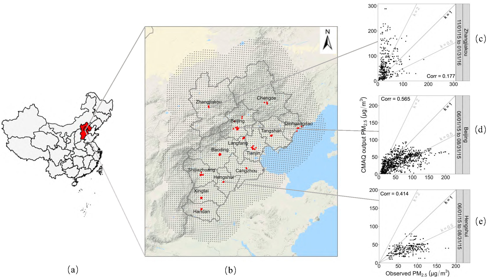

# Efficient and Effective Calibration of Numerical Model Outputs Using Hierarchical Dynamic Models

This Github page provides code for reproducing the results in the manuscript:``Efficient and Effective Calibration of Numerical Model Outputs Using Hierarchical Dynamic Model'' by Y. Chen, X. Chang, B. Zhang, and H. Huang. 

In this paper, we propose a Bayesian hierarchical dynamic model (HDCM) and develop an algorithm based on variational Bayes (VB) and ensemble Kalman smoother (EnKS) to accelerate the parameter estimation and calibration procedure. To further improve the scalability of the HDCM, a Laplace approximation and a space-partitioning-based procedure are embedded in VB and EnKS, respectively. The VB and space-partitioning-based EnKS (spEnKS) have been implemented via our an R package - [HDCM](https://github.com/ChenYW68/HDCM/tree/main/HDCMc/LoadPackages). 


# Datasets
The effectiveness and efficiency of the HDCM is demonstrated via two datasets: 
-	 Moderately large datasets: $PM_{2.5}$ concentrations are from the monitoring stations and the outputs of Community Multiscale Air
Quality (CMAQ, Byun and Schere, (2006)) system for China's Beijing-Tianjin-Hebei (BTH) region, and the sizes are $68 \times 92 = 6{,}256$ spatio-temporal observations and $5{,}587 \times 92 = 514{,}004$ spatio-temporal outputs, respectively 
- Large datasets: $PM_{2.5}$ concentrations are from the reanalysis $PM_{2.5}$ outputs of the Nested Air Quality Prediction Modeling System (NAQPMS, Wang et al., (2006)) and from the raw $PM_{2.5}$ outputs of the CMAQ, and the sizes are $6{,}382 \times 30 = 191{,}460$ reanalysis spatio-temporal outputs and $16{,}093 \times 30 = 482{,}790$ spatio-temporal outputs, respectively 

# An illustration for the first dataset in the BTH region
<figure id="Figure1">
  <p align="center">
  
    </p>
  <figcaption
  <strong>Figure 1:</strong> (a) Map of China. (b) Zoomed-in map of the BTH region along with locations of $68$ monitoring stations (red dots) and centroids of $5{,}587$ 9-km CMAQ grids (gray dots).} (c)-(e) Scatter plots of CMAQ $PM_{2.5}$ forecasts versus actual observations at Zhangjiakou, Beijing, and Hengshui in different seasons, where ``Corr'' represents the Pearson correlation coefficient between CMAQ $PM_{2.5}$ outputs and observed $PM_{2.5}$ concentrations. Three reference lines with the slope k = 0.5, 1, and  2 are colored in gray.
  </figcaption>
</figure>


# An illustration for the second dataset


<figure id="Figure2">
    <p align="center">
  
  </p>
  <figcaption
  <strong>Figure 1:</strong> Maps of grid cells of the CMAQ and the NAQPMS. The symbols ``+'' represent the centroids of 16{,} 093 9km CMAQ grids. The symbols ``*'' denote the centroids of $6{,} 382$ 15km NAQPMS grids.
  </figcaption>
</figure>


## Codes
There are two parts for our codes: 
1. The VB-spENKS algorithm was written into the [HDCM](https://github.com/ChenYW68/HDCM/tree/main/HDCMc/LoadPackages) package in the R statistical environment;
2. A project entitled ``[HDCMc.Rproj](https://github.com/ChenYW68/HDCM/tree/main/HDCMc)'' in the [RStudio](https://www.rstudio.com/products/rstudio/download/) environment was built to reproduce all the results (e.g., figures and tables) in this work. 

```
# Require core package
1. R >= 4.2.1
2. Rcpp >= 1.0.7
3. mgcv >= 1.8-41
```
## Installing and loading dependent packages
-	Open the project file, ``[HDCMc.Rproj](https://github.com/ChenYW68/HDCM/tree/main/HDCMc/LoadPackages)'', based on the [RStudio](https://www.rstudio.com/products/rstudio/download/) tool.

-	Install all the dependent packages via the following command:
```
source("./LoadPackages/RDependPackages.R")
```
Moreover, the [HDCM](https://github.com/ChenYW68/HDCM/tree/main/HDCMc/LoadPackages) package can be installed by running:
```
 install.packages("./LoadPackages/HDCM_1.0.zip", repos = NULL, type = "win.binary")
```

## An example for the proposed HDCM
```
# install.packages("./LoadPackages//HDCM_0.1.0.zip", 
#                  repos = NULL,
#                  type = "win.binary")

rm(list=ls())
source("./LoadPackages/RDependPackages.R")
data("SiteData", package = "HDCM")
data("China_BTH_GeoMap", package = "HDCM")

setDF(obs_PM25_2015w);setDF(Site);
Ch <- 0.23
n.grps <- 1
H.basic.data <- CreateGrid(obs_PM25_2015w,
                           sample.coords = Site,
                           Map = BTH_City_Map,
                           max.edge = c(.35, .65),
                           offset = c(1e-1, 0.5),
                           cutoff = 0.04,
                           distance.scale = 1e3,
                           n.grps = n.grps,
                           col = "black",
                           size = 2,
                           site.id = "ID",
                           factor = 1,
                           ch = Ch,
                           method = "indicator1",
                           distance.method = 1,
                           hjust = c(-1, 1, -1, 0.5)) #indicator
H.basic.data$plot.grid
# ggsave(plot = H.basic.data$plot.grid, height = 6, width = 6,
#        file = './figure/Fig_Small_Map.pdf')
range(H.basic.data$Grid.infor$summary$Hdist)*0.23
H.basic.data$Grid.infor$summary$Knots.count

ds <- max(H.basic.data$Grid.infor$summary$Hdist)*0.23
G <- H.basic.data$Grid.infor$summary$Hdist

apply(G<ds, 1, sum)/ncol(G)

##########################################################################################
#                          3. Data for modeling
##########################################################################################

# CMAQ.cv <- Validation.Group.Region(data = PM25_2015w,
#                                 # sigma = Pred.sd,
#                                 col = c("REAL_PM25",
#                                         "sim_CMAQ_PM25"),
#                                 by = "CITY")
# CMAQ.cv
# writexl::write_xlsx(CMAQ.cv, path = "./Result/CMAQ.cv.xlsx")


DATE_TIME <- unique(obs_PM25_2015w$DATE_TIME) %>% sort()
Nt <- length(DATE_TIME)
date.time <- data.frame(time.index = 1:Nt,
                        time.scale = seq(0, 1, , Nt),
                        time.scale.sin = sin(seq(0, 1, , Nt)/(0.03*pi)),
                        time.scale.cos = cos(seq(0, 1, , Nt)/(0.03*pi)),
                        DATE_TIME = DATE_TIME)
PM25_2015w <- obs_PM25_2015w  %>% left_join(date.time, by = c("DATE_TIME"))


PM25_2015w[, c("sim50_CMAQ_PM25")] <- sqrt(PM25_2015w[, c("sim50_CMAQ_PM25")])
HDCM.Data <- Construct_HDCM_Data(data = PM25_2015w,
                                 include = list(YEAR = c(2015, 2016),
                                                month_day = c("11-01", "1-31")),
                                 Y = "REAL_PM25",#"Bias",#"REAL_PM25",
                                 X = c("sim50_CMAQ_PM25"
                                       , "sim_TEMP"
                                       , "sim_WIND_X"
                                       , "sim_WIND_Y"
                                 ),
                                 standard = T,
                                 center = T,
                                 start.index = 1)
Vari <- var(sqrt(as.vector(HDCM.Data$Y_ts)))

# assign("scaled_variable", ADCM.Data$scaled_variable, envir = .GlobalEnv)
##########################################################################################
#-----------------------------------------------------------------------------------------
#                         4. Model setting
##########################################################################################
{
  ds <- 0.5*max(H.basic.data$Grid.infor$level[[1]]$Max.Dist)
  theta.2 <- c(1e-1, 1e-3, 1)
  res.num <- H.basic.data$Grid.infor$summary$res
  p1 <- dim(HDCM.Data$X_ts)[1]
  #---------------------------------------------------------------------
  #                           4.1 Prior
  #---------------------------------------------------------------------
  prior <- list(
    beta = list(E_beta = rep(0, p1), sigma.sq = 1e5*diag(1, p1, p1))
    , obs.sigma.sq = list(a = 2, b = 1)
    , theta.1 = list(mu = rep(1e-4, res.num), sigma.sq =  rep(1e5, res.num))
    , theta.2 = list(a = rep(theta.2[2], res.num), b =  rep(theta.2[3], res.num))
    , zeta = list(a = rep(1e-3, res.num), b =  rep(2e1, res.num))
    , zeta0 = list(a = rep(1e-3, res.num), b =  rep(2e1, res.num))
    , proc.tau.sq = list(a = rep(2, res.num), b = rep(1, res.num))
    , proc0.tau.sq = list(a = rep(2, res.num), b = rep(1, res.num))
  )
  #---------------------------------------------------------------------
  #                        4.2 initialize  parameters
  #---------------------------------------------------------------------
  para <- list( beta = list(E_beta = c(7.0, 2.5, rep(0, p1 - 2))),
                obs.sigma.sq = list(E_sigma.sq = 1, a = 2, b = 1)
                , theta.1 = list(E_theta.1 = rep(1e-3, res.num))
                , theta.2 = list(E_theta.2 = rep(theta.2[1], res.num))
                , zeta = list(E_zeta = rep(1e0, res.num))
                , zeta0 = list(E_zeta0 = rep(1e0, res.num))
                , proc.tau.sq = list(E_tau.sq = rep(5e0, res.num))
                , proc0.tau.sq = list(E_tau.sq = rep(1, res.num))
  )
}
##########################################################################################
#                          5. Model fitting and prediction
##########################################################################################
# library(CovUtil)

Cs <- 0.3
Ct <- 1
Ne <- 100


tab.1 <- strsplit(as.character(Ch), ".", fixed = TRUE)[[1]][2]
tab.2 <- strsplit(as.character(Cs), ".", fixed = TRUE)[[1]][2]

# tab <- paste0(tab.1, "_", tab.2, "_", Ct)
tab <- paste0(n.grps, "_", tab.1, "_", tab.2)
assign("Ch", Ch, envir = .GlobalEnv)
hdcm.table <- "HDCMw_"
Obj.Seq <- 1:13
CVw_BTH <- HDCM(Tab = paste0(hdcm.table, tab),
                Site = Site,
                HDCM.Data = HDCM.Data,
                H.basic.data = H.basic.data,
                prior = prior,
                ini.para = para,
                CV = T,
                verbose.VB = TRUE,
                verbose = TRUE,
                Object = "CITY",
                transf.Response = c("SQRT"),
                Database = list(DSN = RODBC::odbcConnect("DSN_01",
                                                         uid = "myname",
                                                         pwd = "mypwd",
                                                         believeNRows = FALSE,
                                                         case = "toupper")),
                response.scale = FALSE,
                save.Predict = TRUE,
                ensemble.size = Ne,
                # n.cores = 5,
                factor = 1,
                cs = Cs,
                ct = Ct,
                tol.real = 1e-3,
                itMin = 1e1,
                itMax = 2e2,
                Obj.Seq = Obj.Seq)
# save(CVw_BTH, file = paste0("./CV/Result/", hdcm.table, tab, "_", Obj.Seq[1], ".RData"))
```
